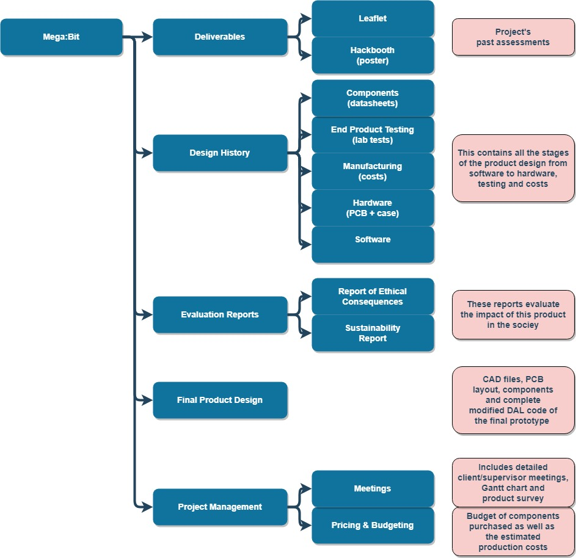

# Mega-Bit
Imperial College London Electrical and Electronic Engineering 3rd year project for the Micro:Bit community

The project aim was to create a teaching aid to assist with using the BBC micro:bit to teach programming in schools. To do this it must replicate all of the student's work on a larger scale for the whole class to see. It should do this with no impact on the student's code, simply plug the student's micro:bit in and watch!

## Repository structure:

