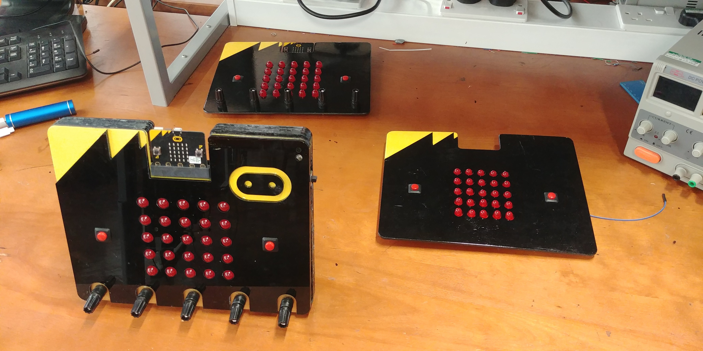

# Mega-Bit
Imperial College London Electrical and Electronic Engineering 3rd year project for the Micro:Bit community

<pre>
├───Deliverables
│   ├───Hackbooth
│   │   └───Poster Illustrations
│   └───Leaflet
│       └───Leaflet Illustrations
├───Design History
│   ├───Components
│   │   ├───Battery Indicator
│   │   ├───Connector Schematics
│   │   ├───Currently Used Components
│   │   ├───I2C LED Matrix and Driver
│   │   ├───Microbit Breakout Board
│   │   └───Power Supply
│   ├───Hardware
│   │   ├───PCB
│   │   │   ├───MEGABIT FINAL PCB
│   │   └───Prototype Modelling
│   ├───Manufacturing
│   └───Software
├───End Product Testing
│   └───Pictures
├───Evaluation Reports
├───Final Product Design
├───Pricing and Budgeting
│   └───Expense Claims
└───Project Management
    └───Meetings
</pre>
